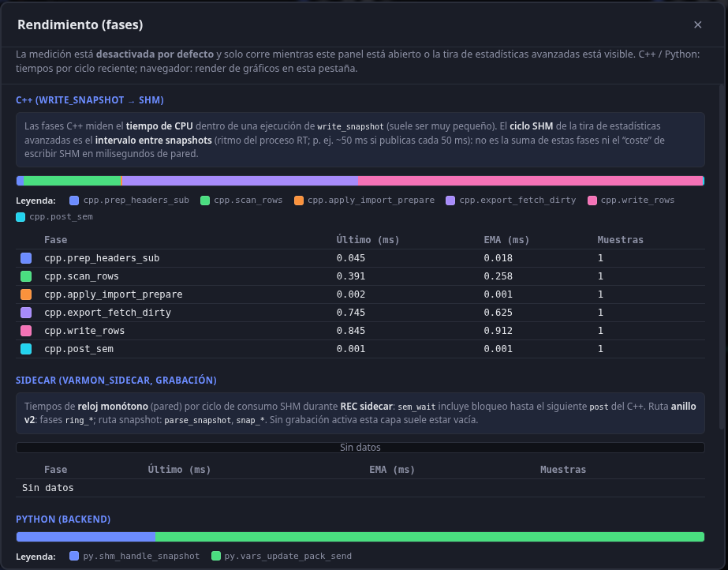
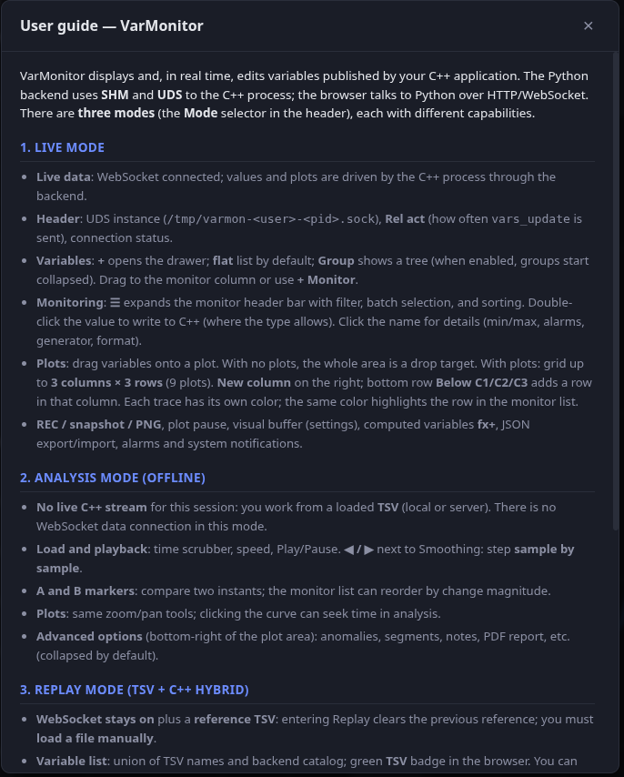
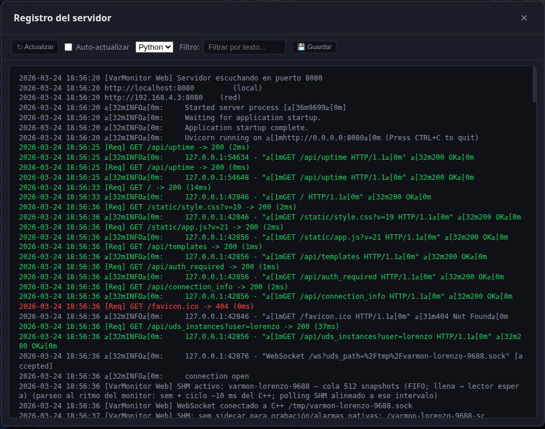

# VarMonitor — Real-time variable monitor

**VarMonitor** links a **C++20** process to a **browser-based** control room: live values, time-series plots, alarms, and disk recording—without TCP on the data path. Your app embeds **libvarmonitor**; the stack talks over **Unix domain sockets (UDS)** for RPC and **POSIX shared memory (SHM)** for high-rate snapshots. The web backend (FastAPI) maps the same SHM segment and pushes filtered updates to clients over **WebSockets**.


> **Spanish:** detailed docs in Spanish live under [`docs/`](docs/); this README is in English for the default GitHub landing page.

### How data moves (short)

1. **UDS**: list/register/get/set variables, SHM subscription, perf lease, etc. (length-prefixed JSON).
2. **SHM v2**: fixed header + table of subscribed variables + optional **ring-buffer arena** (per-variable time+value slots for ring export mode). Each publish bumps a global `seq` and does **`sem_post` on two semaphores**: one for the Python reader, one for **`varmon_sidecar`** (native recorder / alarm worker) so consumers never steal each other’s wakeups.
3. **Browser**: only **monitored** names are sent in `vars_update`; rate is throttled (**Rel act**) and can drive **partial SHM export** in C++ during passive viewing to save CPU.

See **[docs_en/protocols.md](docs_en/protocols.md)** for layout, semaphores, and sidecar semantics; **[docs_en/performance.md](docs_en/performance.md)** for dirty/skip-unchanged/slicing/async publish and sidecar recording optimizations.

## Full documentation

Detailed docs are in **[docs/](docs/)** (Spanish) and **[docs_en/](docs_en/)** (English), built with [MkDocs](https://www.mkdocs.org/):

```bash
pip install mkdocs mkdocs-material
mkdocs serve                    # Spanish preview
mkdocs serve -f mkdocs.en.yml   # English preview
```

Static build for the web monitor:

```bash
mkdocs build
mkdocs build -f mkdocs.en.yml
```

Outputs: `site/` → **`/docs/es/`**, `site_en/` → **`/docs/en/`**. The monitor’s **Docs** button opens a language picker.

**English (Markdown in repo):**

- [Architecture](docs_en/architecture.md) — Components, data flow, instance discovery, visual vs internal rates.
- [Installation and configuration](docs_en/setup.md) — Requirements, quick install, `varmon.conf`.
- [Docker](docs_en/docker.md) — Container image, bridge vs host mode.
- [Packaged binary (PyInstaller)](docs_en/build-binary.md) — Single executable without pip on the target.
- [Launch scripts](scripts/LAUNCH.md) — `launch_demo` / `launch_web` / `launch_ui`; `stop_varmonitor`; `build_docs_pdf`.
- [Backend (Python)](docs_en/backend.md) — Routes, WebSocket, UdsBridge, ShmReader, alarms and recording.
- [Frontend](docs_en/frontend.md) — modular client (`static/js/entry.mjs`, ES modules, optional bundle), columns, Plotly charts, state and persistence.
- [Protocols](docs_en/protocols.md) — UDS format, commands, SHM layout, alarms and recording.
- [C++ integration](docs_en/cpp-integration.md) — Linking libvarmonitor, basic usage, macros.
- [Troubleshooting](docs_en/troubleshooting.md) — WSL/semaphores, connection issues, empty charts.

---

## Quick install

```bash
# 1. Install dependencies
chmod +x scripts/varmon/setup.sh
./scripts/varmon/setup.sh

# 2. Build
mkdir -p build && cd build
cmake .. && make -j$(nproc)

# 3–5. Three terminals (or run in background): demo C++, web backend, UI
cd ..   # back to repo root
./scripts/launch_demo.sh
./scripts/launch_web.sh
./scripts/launch_ui.sh   # picks highest responding port in varmon.conf range
```

See **[scripts/LAUNCH.md](scripts/LAUNCH.md)**.

## Docker

Run only the web backend in a container (browser on the host):

```bash
docker compose up --build
# or: ./scripts/varmon/docker-run.sh
```

For **live** monitoring against the **host C++ process** on **Linux** (shared `/tmp` UDS + SHM), use the host-network compose file:

```bash
docker compose -f docker-compose.host.yml up --build
# or: ./scripts/varmon/docker-run.sh host
```

See **[docs/docker.md](docs/docker.md)** (Spanish) or **[docs_en/docker.md](docs_en/docker.md)** (English). To embed the monitor in another image without depending on submodule paths, install the three runtime packages listed in **`web_monitor/requirements-docker.txt`** via `RUN pip install ...` in your Dockerfile (see docs); that file is the version reference.

## Standalone binary (no Python on target)

Build a single executable with PyInstaller (details: **[docs_en/build-binary.md](docs_en/build-binary.md)**):

```bash
./scripts/varmon/build_varmonitor_web.sh
# → web_monitor/dist/varmonitor-web
```

To run the PyInstaller build: **`export VARMON_PACKAGED_WEB_BIN=.../varmonitor-web`** then **`./scripts/launch_web.sh`**; open the UI with **`./scripts/launch_ui.sh`** (needs `python3` for these launcher scripts only; see [docs_en/build-binary.md](docs_en/build-binary.md)).

## Configuration: varmon.conf

Minimal example:

```
web_port = 8080
```

Optional: `cycle_interval_ms`, `update_ratio_max`, `lan_ip`, `bind_host`, `auth_password`, `server_state_dir`, **`shm_max_vars`**, **`shm_ring_depth`**, **`shm_default_export_mode`**, **`shm_publish_*`**, **`shm_async_publish`**, **`recording_backend`**, **`shm_parse_hz_sidecar_recording`**, `recording_sidecar_bin`, **`sidecar_cpu_affinity`**, etc.

- **shm_max_vars** / **shm_ring_depth**: size the v2 segment (table + ring arena). Must match C++ and Python; **restart both** after changes.
- **C++ publisher tuning**: `shm_publish_dirty_mode`, `shm_publish_full_refresh_cycles`, `shm_publish_skip_unchanged`, `shm_publish_slice_count`, `shm_async_publish` — see **[docs_en/performance.md](docs_en/performance.md)**.
- **Native recording**: **`recording_backend = sidecar_cpp`** runs **`varmon_sidecar`** on **`sem_sidecar_name`**; Python uses **`sem_name`**. UI refresh from SHM can be capped (**`shm_parse_hz_sidecar_recording`**, default 30 Hz; `0` = drain main sem without parsing — values freeze). **`sidecar_cpu_affinity`** (Linux) pins sidecar PIDs via `sched_setaffinity`.
- **Perf**: header **Perf** + **`GET /api/perf`** aggregate Python, C++ (`shm_perf_us`), and sidecar (`--perf-file`) phases when a lease is active.

Config file path: environment variable `VARMON_CONFIG` or in C++ `varmon::set_config_path(...)`.

## Integrating into your C++ project

```cmake
add_subdirectory(libvarmonitor)
target_link_libraries(your_app PRIVATE varmonitor)
```

```cpp
#include <var_monitor.hpp>

varmon::VarMonitor monitor;
monitor.register_var("sensors.temperature", &temperature);
monitor.start(100);  // 100 ms between samples; starts UDS and SHM

// In your control loop (e.g. 100 Hz):
monitor.write_shm_snapshot();
```

With macros: `var_monitor_macros.hpp`, `VARMON_WATCH`, `VARMON_START`, etc.

## Web monitor features

- **Layout**: variable browser, monitored list (drag to plots, virtualized when large), multi-plot workspace (Plotly), advanced tools drawer (segments, notes, PDF, etc.).
- **Modes**: **Live** (SHM + C++), **Analysis** (offline TSV or Parquet recordings), **Replay** (TSV timeline with optional per-variable imposition onto live SHM).
- **Formats & ARINC**: per-variable display format (decimal/sci/hex/bin), optional **unit conversion** and ARINC 429 word view where applicable.
- **Alarms**: Hi/Lo per variable; rolling capture; optional **native** evaluation path via sidecar + rules TSV.
- **Recording**: Python writer thread or **`varmon_sidecar`** TSV path; progress, path toasts, optional base64 send on finish.
- **Performance UX**: **Rel act** (WebSocket cadence), linked **SHM publish slice**, adaptive tab throttling, chart downsampling, **Perf** tri-layer panel.
- **Ops**: optional auth password, multi-instance port scan, built-in log viewer, MkDocs help (`/docs/en/`), settings persistence, keyboard shortcuts (e.g. record, screenshot).

## Screenshots

The same assets live under [`docs/images/`](docs/images/) (MkDocs) and [`pictures/`](pictures/) in the repo root.

| Live — dark theme |
|-------------------|
|  |

| Analysis mode (offline TSV / Parquet) | Replay mode (TSV + live SHM) |
|-----------------------------|------------------------------|
|  |  |

| Advanced plot tools | Perf panel (`/api/perf`) |
|---------------------|-------------------------|
|  |  |

| Help (in-app guide) | Built-in log viewer |
|---------------------|---------------------|
|  |  |

## Project layout

```
monitor/
├── data/
│   └── varmon.conf      # Config (también: VARMON_CONFIG o ./varmon.conf en cwd)
├── libvarmonitor/       # C++: VarMonitor, shm_publisher, uds_server
├── demo_app/
├── tool_plugins/        # Optional Pro Python package: pip install -e tool_plugins/python
├── web_monitor/         # Python FastAPI, UdsBridge, ShmReader
│   ├── recordings/      # TSV recordings and alarms (generated)
│   └── static/
├── docs/                # MkDocs documentation (Spanish); images in docs/images/
├── docs_en/             # MkDocs documentation (English); images in docs_en/images/
├── pictures/            # Screenshot sources (mirrored under docs/*/images/ for MkDocs)
└── scripts/
```
