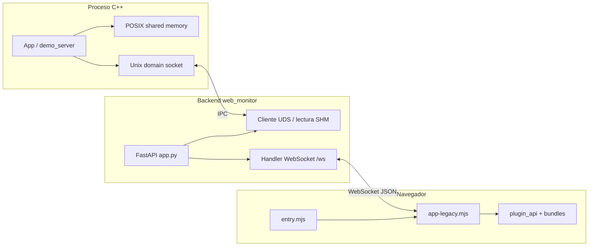
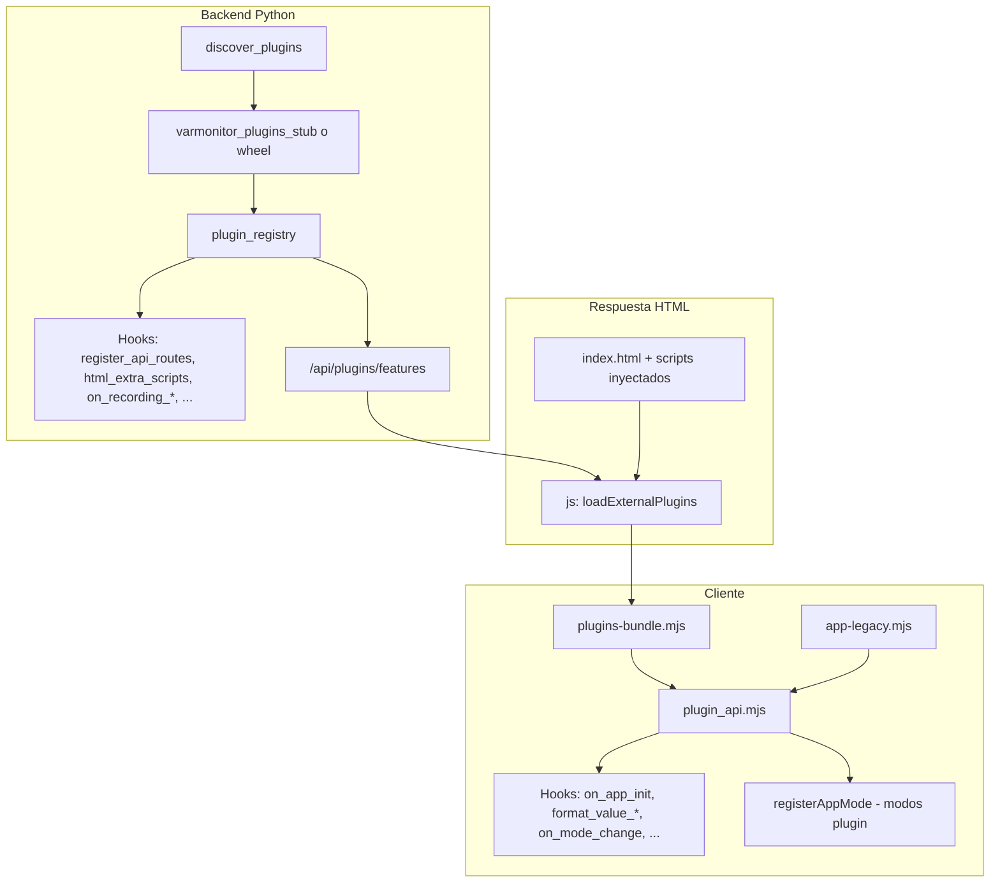

# VarMonitor — Guía de flujo de trabajo, arquitectura y frontend

Este documento recoge **cómo trabajar con el repositorio**, **cómo encajan las piezas** (C++, Python, WebSocket, navegador) y **cómo está organizada la interfaz** (modos live/offline/replay, plugins, etc.). Está pensado para alguien que entra en el proyecto o necesita un mapa mental detallado sin leer solo código disperso.

---

## 1. Resumen de conversaciones (contexto de este documento)

No existe un registro automático “completo” de todos los chats en el repo; esta sección resume **lo que sí consta explícitamente** en el hilo que llevó a este fichero:

| Tema | Contenido |
|------|-----------|
| **Commit de trabajo** | Se consolidó un commit (`c69b7b8` en la rama `feature/replay-ref-alarms-unitary-pro-ui`) con trabajo MIL-STD-1553 y UI: nuevo `tool_plugins/js/src/m1553-registry.mjs`, actualización de `plugins-bundle.mjs` (plugin `m1553` v0.2, hook `m1553_api`), registro del plugin en `tool_plugins/python/.../varmonitor_plugins/__init__.py`, cambios en `app-legacy.mjs`, `i18n.mjs`, `flight-viz.mjs`, `style.css` y la base `m1553_registry.sqlite`. Se **excluyó** del commit el artefacto `tests/js/node_modules/.vite/vitest/results.json` (salida de Vitest). |
| **Este documento** | Petición de un `.md` en la raíz con flujo de trabajo, arquitectura interna (plugins, etc.) y resumen del frontend. |

Cualquier detalle adicional sobre decisiones de diseño en chats anteriores debe contrastarse con el código y con `AGENTS.md`.

---

## 2. Qué es VarMonitor (una frase)

**Sistema de monitorización en tiempo real de variables** de aplicaciones C++20, con **interfaz web** en el navegador: la app nativa publica datos vía **memoria compartida POSIX y sockets Unix**; el **backend FastAPI** los reenvía por **WebSocket** al cliente JavaScript.

---

## 3. Estructura del repositorio (mapa rápido)

| Ruta | Rol |
|------|-----|
| `libvarmonitor/` | Biblioteca C++ núcleo. |
| `demo_app/` | Aplicación de demostración (p. ej. `demo_server`). |
| `varmon_sidecar/` | Proceso opcional C++ (grabación/alarma nativa según configuración). |
| `web_monitor/` | Backend Python (FastAPI) + **todo el frontend** (`static/`, plantillas). |
| `data/varmon.conf` | Configuración central (puerto web, rutas de datos, backend de grabación, etc.). |
| `tool_plugins/` | **Fuente** de plugins empaquetables (JS bundle + wheel Python `varmonitor_plugins`). En runtime, el OSS usa `varmonitor_plugins_stub` o el wheel instalado; el JS se sirve desde `web_monitor/static/plugins/`. |
| `scripts/` | Arranque y tests (véase `scripts/LAUNCH.md`). |

---

## 4. Flujo de trabajo típico de desarrollo

### 4.1. Compilar C++ (GCC)

En entornos donde Clang no enlaza bien con `-lstdc++`, el proyecto recomienda **GCC**:

```bash
mkdir -p build && cd build
cmake -DCMAKE_C_COMPILER=gcc -DCMAKE_CXX_COMPILER=g++ ..
make -j$(nproc)
```

### 4.2. Entorno Python

```bash
cd web_monitor
source .venv/bin/activate
pip install -r requirements.txt
```

### 4.3. Variable de configuración

Todas las piezas deben apuntar al mismo `varmon.conf`:

```bash
export VARMON_CONFIG=/ruta/al/repo/data/varmon.conf
```

Los scripts en `scripts/` suelen cargar `scripts/simple_config.sh`.

### 4.4. Orden de servicios (lo habitual)

1. **Proceso C++** (`demo_server` u otra app instrumentada): expone datos al backend vía UDS/SHM.
2. **Backend web**: desde el directorio `web_monitor/` — `python app.py` (puerto por defecto en `varmon.conf`, p. ej. 8080).
3. **Navegador**: `http://localhost:8080` o `./scripts/launch_ui.sh`.

### 4.5. Grabación sin binario sidecar

Si `recording_backend = sidecar_cpp` y no hay `varmon_sidecar` construido, la grabación puede fallar; para desarrollo se puede usar `recording_backend = python` en la configuración.

### 4.6. Tests

`./scripts/run_tests.sh` — Python (pytest), C++ (gtest), JS (Vitest bajo `tests/js/`). Cobertura opcional documentada en `scripts/LAUNCH.md`.

---

## 5. Arquitectura de datos (extremo a extremo)

### 5.1. Diagrama lógico



- El **cliente no habla UDS directamente**: el navegador solo usa **HTTP** y **WebSocket** contra el backend Python.
- El backend traduce entre el protocolo interno (C++) y mensajes WebSocket hacia la UI.

### 5.2. Arranque temprano del WebSocket (`early-network.mjs`)

`static/js/entry.mjs` carga Plotly, ejecuta `startEarlyWebSocketIfLive()` **antes** del `import()` pesado de `app-legacy.mjs`, para que la conexión WebSocket no quede bloqueada tras evaluar ~cientos de KB de JS.

Condiciones resumidas:

- Lee `localStorage` (`varmon_config`): si el modo guardado es **offline**, no abre WS anticipado.
- Si el modo es **live**, **replay**, **arinc_registry** (BD protocolos), intenta abrir el WS tras comprobar `/api/auth_required` y resolver instancia UDS vía `/api/uds_instances` y `/api/connection_info`.
- Los **modos solo de plugin** (p. ej. edición de ficheros) **no** siguen este camino temprano.

---

## 6. Sistema de plugins — visión unificada

Hay **dos registros coordinados** pero no idénticos:

| Capa | Fichero clave | Función |
|------|---------------|---------|
| **Python** | `web_monitor/plugin_registry.py` | `register_hook`, `register_plugin`, `fire_hook`, `fire_hook_chain`, `discover_plugins()`. |
| **JavaScript** | `web_monitor/static/js/modules/plugin_api.mjs` | Misma idea en el cliente: plugins, hooks y además **`registerAppMode`** para modos de UI. |

### 6.1. Descubrimiento en el backend

Al importar `app.py`:

1. Se ejecuta `plugin_registry.discover_plugins()`.
2. Se intenta cargar, en orden, `varmonitor_plugins` (wheel) o `varmonitor_plugins_stub` (desarrollo en árbol).
3. Cada módulo debe exponer `register(register_hook, register_plugin)`.

El **stub** (`varmonitor_plugins_stub.py`) registra plugins “dev” e inyecta un `<script type="module" src="/static/plugins/plugins-bundle.mjs">` vía el hook `html_extra_scripts`.

El **wheel** en `tool_plugins/python/...` registra más metadatos, hooks de grabación Parquet y, si está disponible, rutas API adicionales (`register_api_routes` → `file_edit_api`).

### 6.2. Hooks Python usados por el core (referencia)

| Hook | Momento / uso |
|------|----------------|
| `register_api_routes` | `lifespan` de FastAPI: los plugins añaden rutas al objeto `app`. |
| `html_extra_scripts` | Al servir `index.html`: se concatenan strings `<script ...>` extra. |
| `extend_connection_info` | Cadena sobre el diccionario devuelto por `/api/connection_info`. |
| `on_recording_start` | Al iniciar grabación desde el cliente WS (`var_names`, `formato`). |
| `on_recording_stop` | Al parar grabación. |
| `on_ws_action` | Acciones genéricas del WebSocket (extensión del protocolo). |

La lista exacta evoluciona; `plugin_registry.get_hooks()` expone conteos en runtime.

### 6.3. Endpoint de alineación frontend/backend

`GET /api/plugins/features` devuelve:

- `features`: IDs de plugins registrados en Python (`plugin_registry.get_registered_plugin_ids()`).
- `hooks`: resumen de hooks registrados en el backend.

El cliente usa esto en `loadExternalPlugins()` para decidir si intenta cargar el bundle JS y para **registrar plugins “fantasma”** si el backend dice que existen pero el import del bundle falla (así `hasPlugin(id)` sigue siendo coherente con el servidor).

### 6.4. Bundle JavaScript

Orden de intento de carga (ver `plugin_api.mjs`):

1. `/static/plugins/plugins-bundle.mjs`
2. `/static/plugins/varmonitor-plugins.bundle.min.js`

El módulo debe exportar `register(registerPlugin, registerHook, registerAppMode)`.

El **fuente** del bundle en el monorepo suele estar en `tool_plugins/js/src/plugins-bundle.mjs`; la copia servida está bajo `web_monitor/static/plugins/` (y debe mantenerse alineada en integración continua o copia manual según el flujo del equipo).

### 6.5. Plugins y hooks en el bundle (ejemplo actual)

En `tool_plugins/js/src/plugins-bundle.mjs` (resumen):

- **ARINC**: `registerPlugin("arinc", ...)`, hooks de validación de importación tabular, `format_value_arinc_extras`.
- **MIL-STD-1553**: `registerPlugin("m1553", ...)`, `registerHook("m1553_api", () => m1553)` para exponer el módulo de registro/decodificación al resto de la UI.
- **replay_alias**: `replay_alias_api` para alias de columnas en offline/replay.
- **Otros IDs** registrados como metadatos: anomaly, segments, parquet, replay_ref_alarms.
- **Inicializadores** que montan modos/paneles: `initFileEdit`, `initGitWorkspace`, `initTerminal`, `initFlightViz`.

En el **núcleo OSS** (`app-legacy.mjs`), además, si tras `loadExternalPlugins()` no hay plugin `m1553`, se registra un **builtin** mínimo y un hook `format_value_m1553` ligado al registro en cliente — diseño defensivo para que la decodificación no dependa solo del bundle externo.

### 6.6. Hooks JavaScript frecuentes (no exhaustivo)

| Hook (cliente) | Rol típico |
|----------------|------------|
| `on_app_init` | Tras cargar plugins; arranque de subsistemas del bundle. |
| `on_mode_change` | Cambio entre live / offline / replay / modos de plugin. |
| `on_vars_update` | Tras aceptar un lote de variables del WS. |
| `on_offline_dataset_loaded` | Dataset TSV/Parquet cargado en análisis. |
| `format_value_arinc` / `format_value_m1553` | Cadena de formateo en tablas/gráficos. |
| `arinc_validate_tabular_import` | Validación de importación al registro ARINC. |
| `replay_alias_api` | API para mapeo de nombres en replay. |
| `m1553_api` | API del registro MIL-STD-1553 para módulos que la consumen. |

---

## 7. Modos de aplicación (`appMode`) — corazón del “frontend por páginas”

VarMonitor es una **SPA** (una sola `index.html`); la “página” activa se elige con la variable **`appMode`**, persistida en `localStorage` bajo la clave `varmon_config`.

### 7.1. Modos núcleo (built-in)

| Modo | Significado breve |
|------|-------------------|
| `live` | Monitorización en tiempo real contra el proceso C++ vía backend + WebSocket. |
| `offline` | Análisis de ficheros locales o del servidor (TSV/Parquet) sin depender del stream en vivo. |
| `replay` | Reproducción temporal alineada con grabaciones (misma tubería de análisis que offline en muchos aspectos). |
| `arinc_registry` | Pantalla de **base de datos de protocolos** (pestañas ARINC 429 y MIL-STD-1553); convive con rutas API `/api/arinc_db/*`, `/api/m1553_db/*`, etc. |

Compatibilidad: valores antiguos `terminal` se migran a `file_edit` en la configuración cargada.

### 7.2. Modos registrados por plugins (`registerAppMode`)

Los plugins pueden añadir modos propios (p. ej. editor de ficheros, visualización de vuelo). Metadatos típicos (`plugin_api.mjs`):

- `labelFallback` / `labelKey` (i18n)
- `bodyClass` para estilos por modo
- `needsBackendConnection`
- `onEnter` / `onLeave`

La UI ofrece un **selector de modo** en cabecera (“Modo”) y un overlay inicial (`#modePickerOverlay`) cuando procede.

### 7.3. Dónde vive la lógica

- Estado global y transiciones: `web_monitor/static/js/app-legacy.mjs` (`setAppMode`, `isLiveMode`, `isOfflineMode`, …).
- Carga de plugins: `loadExternalPlugins()` → `fireHook("on_app_init")` → `applyInitialConfigFromStorage()` → `checkAuthThenStart()`.

---

## 8. Frontend — desglose de la interfaz

### 8.1. Punto de entrada

- **`static/index.html`**: maquetación del shell (cabecera, overlays de auth, selector de modo, paneles). Incluye placeholders procesados en el servidor para inyectar el script principal y extras de plugins.
- **`static/js/entry.mjs`**: orden de carga (Plotly, red temprana, `app-legacy` diferido).
- **`static/js/app-legacy.mjs`**: aplicación principal (orden de ~20k líneas): WebSocket, tablas, gráficos Plotly, modos, registro ARINC/M1553, ajustes, i18n, etc.
- **`static/style.css`**: estilos globales y por componente.

### 8.2. Autenticación

- Overlay `#authOverlay` para contraseña del WebSocket si el servidor la exige (`/api/auth_required`).
- Overlay `#sensitiveAuthOverlay` para operaciones restringidas (“ingeniería”).
- `auth-fetch.mjs` centraliza fetch con credenciales según el esquema del proyecto.

### 8.3. Cabecera y monitorización

- **Estado de conexión** (`#connectionStatus`), **conteo de variables**, selector de **instancia** / UDS (`#portSelect`, reconexión).
- **Modo** actual visible (`#modeCurrentLabel`, `#modeMenuBtn`).
- Controles **offline** (carga de grabaciones, explorador remoto, test unitario de paquetes) visibles según modo.
- **Ajustes** (`#settingsPanel`): plantillas de dashboard, idioma (es/en), tema, buffer visual, formato de grabación, gestión avanzada.
- **Indicador ARINC BD**, documentación, log del servidor, perf, ayuda.
- Franja opcional de **estadísticas avanzadas** (RAM Py/C++/heap JS, red, FPS UI) si el usuario activa “Adv info”.

### 8.4. Áreas funcionales principales (conceptualmente “páginas”)

Aunque es una sola página, mentalmente se pueden separar:

| Área | Descripción |
|------|-------------|
| **Monitor en vivo** | Tabla/gráficos de variables conectadas al WS; depende de `live` y conexión al backend. |
| **Análisis offline / replay** | Carga de series desde disco; herramientas de comparación, alarmas de referencia en cliente (`replay_ref_alarms`), alias, segmentos. |
| **BD protocolos** | Registro SQLite por protocolo: `arinc_registry.sqlite` y `m1553_registry.sqlite` bajo el directorio de datos (`arinc_data/` por defecto; ver `varmon_web/paths.py`). Pestañas ARINC / MIL-STD-1553 en UI. |
| **Plugins de modo** | Paneles como **flight-viz** (visualización de vuelo), **file-edit**, **terminal**, **git-workspace**, según bundle y permisos. |

### 8.5. Internacionalización

- `static/js/modules/i18n.mjs`: cadenas y selector de idioma en ajustes; las etiquetas de modos plugin pueden usar `labelKey`.

### 8.6. Módulos de dominio aviónica

- **ARINC**: lógica compartida en `static/js/modules/arinc-registry.mjs` y plugins bajo `static/plugins/`.
- **MIL-STD-1553**: convención de nombres `RT{n}_W{k}_suffix`; registro y API espejadas al estilo ARINC (`/api/m1553_db/*`, `/api/m1553_registry/*`). Implementación en cliente también enlazada desde `static/js/modules/m1553-registry.mjs` hacia `static/plugins/m1553/m1553-registry.mjs`.

---

## 9. Backend — APIs que más toca el frontend

Lista **orientativa** (no sustituye a OpenAPI/FastAPI docs):

- **Variables y datos**: `GET /api/vars`, `GET/POST /api/var/{name}`, `GET /api/history/{name}`.
- **Grabaciones**: `GET /api/recordings`, ventanas temporales, `POST` export TSV, etc.
- **Sesiones y plantillas**: `/api/sessions`, `/api/templates`.
- **Log y administración**: `/api/log`, `/api/admin/storage`, `/api/admin/runtime_config`.
- **Instancias UDS**: `/api/uds_instances`, `/api/connection_info`, `/api/instance_info`.
- **Aviónica / registro**: `/api/arinc_db/*`, `/api/arinc_registry/*`, `/api/m1553_db/*`, `/api/m1553_registry/*`, `/api/avionics_registry`.
- **Plugins**: `/api/plugins/features`.
- **WebSocket**: `/ws` — canal principal de telemetría y comandos (monitorización, grabación, etc.).

---

## 10. Esquema mental: plugins en un solo diagrama



---

## 11. Cómo mantener este documento útil

- Tras cambios grandes en **hooks** o en el **contrato del bundle**, actualizar las tablas de las secciones 6 y 8.
- Tras renombrar rutas API o modos, revisar secciones 7 y 9.
- El archivo **`AGENTS.md`** sigue siendo la referencia corta para agentes y CI; este documento es la **versión extendida legible por humanos**.

---

*Última actualización alineada con el estado del repositorio en la rama de trabajo mencionada en la sección 1.*
