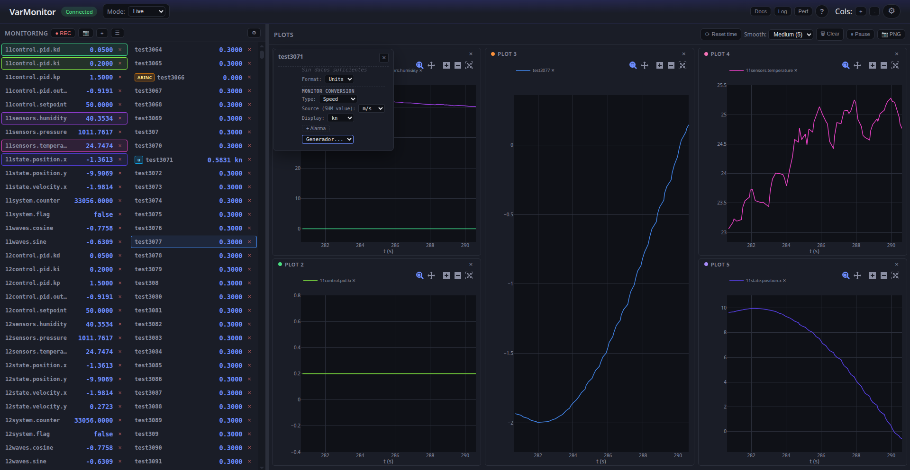
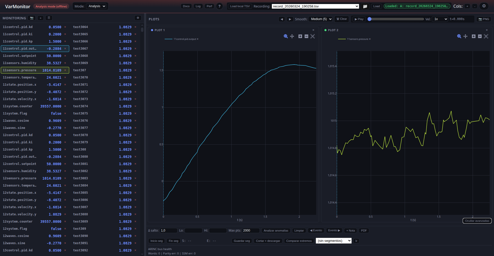

# Frontend

The frontend is a SPA under [web_monitor/static/](../web_monitor/static/): `index.html`, stylesheets, and a **modular ES client** (`js/entry.mjs` → `app-legacy.mjs`, `constants` / `i18n` modules; optional IIFE bundle via esbuild). It uses **Plotly.js** for charts.

## UI overview

Header with connection state, **mode** selector (Live / Analysis / Replay), **Rel act**, theme and language; three columns (browser, monitor, plots).

{ width="100%" }

{ width="100%" }

## Client code structure

- **ES modules**: [`entry.mjs`](../web_monitor/static/js/entry.mjs) loads the main logic; constants and i18n live under [`js/modules/`](../web_monitor/static/js/modules/). Without a bundler, the browser loads `.mjs` files with `type="module"`.
- **Global state** (main module scope): `monitoredNames`, `monitoredOrder`, `varGraphAssignment`, `arrayElemAssignment`, `graphList`, `historyCache`, `arrayElemHistory`, `plotInstances`, `alarms`, `computedVars`, `appMode`, `offlineDataset`, etc.
- **Initialization**: After load, `loadConfig()`, `pruneArincDerivedFromMonitored()`, `applyTheme()`, `applyLanguage()`, listeners, plot area `ResizeObserver`, and `rebuildPlotArea()`.

## Three columns

1. **Column 1 (variable browser)**: Known variables (`knownVarNames`), filter, optional grouping, checkboxes to add to "monitor" or select for drag. Drag & drop to column 2 or onto a chart.
2. **Column 2 (monitor)**: Live variables with current value. Order from `monitoredOrder`. Each row can assign the variable to a chart (`varGraphAssignment[name] = gid`). Monitored variables are sent to the backend via WebSocket (`monitored`).
3. **Column 3 (charts)**: Plotly area. Slots per chart (`graphList`: IDs `g1`, `g2`, ...). Each slot has `#plotContainer_<gid>`. Variables assigned to a chart come from `varGraphAssignment` and `arrayElemAssignment`; **getVarsForGraph(gid)** returns names for that `gid`.

## Live data flow (WebSocket)

- On connect, the frontend sends the monitored list (`monitored`) and the backend sends `vars_update` snapshots.
- The message handler updates `historyCache` and `arrayElemHistory`, then calls **schedulePlotRender()**.
- **schedulePlotRender()**: If not paused and throttle allows (adaptive load), queues **requestAnimationFrame** → **renderPlots()**.

## Charts: key functions

- **rebuildPlotArea()**: Purge Plotly from existing containers, clear the area (except `#plotEmpty`), for each `gid` in `graphList` create a slot (header + `#plotContainer_<gid>`). Insert slots before `plotEmpty`. If there is at least one chart, hide `plotEmpty` so the grid fills height; if none, show `plotEmpty` (drop zone for new chart).
- **renderPlots()**: For each `gid`, get variables with **getVarsForGraph(gid)**, build traces from `historyCache` / `arrayElemHistory` (time window from `timeWindowSelect`), optional smoothing, then `Plotly.newPlot` or `Plotly.react`. Updates `plotEmpty` visibility and render stats. **Second paint after F5**: the first time `renderPlots()` finishes with `graphList.length > 0`, schedule one extra **schedulePlotRender()** at 500 ms (`__plotSecondPaintScheduled`) so curves redraw once WebSocket data has arrived.
- **getVarsForGraph(gid)**: Names assigned to `gid`: entries in `monitoredNames` with `varGraphAssignment[name] === gid`, plus ARINC-derived names pointing to `gid`, plus `arrayElemAssignment` entries for `gid`.

## Persistence (localStorage)

- **saveConfig()** / **loadConfig()**: Store and load under `varmon_config` monitored list, `varGraphAssignment`, `graphList`, time window, theme, language, mode (live/offline/replay), recording paths, etc. On load, `rebuildPlotArea()` runs at end of init so chart slots exist immediately.

## Modes: live, analysis and hybrid replay

- **Live**: Data via WebSocket from the backend (SHM/UDS). UDS instance selector, Rel act (`update_ratio`), recording, alarms.
- **Offline (analysis)**: Load TSV recordings (server or local file). Frontend requests time windows via API (`/api/recordings/{filename}/window` or `window_batch`) and fills `historyCache` / `arrayElemHistory`. `offlineDataset`, `offlineRecordingName`, segments, scrubber and playback controls are specific to this mode.
- **Replay (hybrid)**: WebSocket stays on for `vars_names`/`vars_update` from SHM while using a TSV as a time reference. Variable list is the union of backend + TSV. Only TSV variables marked **impose** continuously write to SHM from TSV values (with `Δt`/`Δv` offsets); non-imposed TSV variables behave like normal SHM variables.

{ width="100%" }

{ width="100%" }

## Advanced options (plot area)

Collapsible panel (bottom-right) for anomalies, segments, notes, PDF report, etc.

{ width="100%" }

## In-app help and log viewer

- **Help** (`H` / `?`): modal with per-mode guidance and links to MkDocs when built.

{ width="100%" }

- **Log**: panel with Python backend log (and optional C++ tail via `log_file_cpp`); see [Installation — Log viewer](setup.md#built-in-log-viewer).

{ width="100%" }

## Chart resize

- A **ResizeObserver** watches `#plotArea`. On size change, **Plotly.relayout** each chart container to current `getBoundingClientRect()`.

## Perf panel

- Header **Perf** button: full-screen overlay that polls **`GET /api/perf`** while open.
- Three sections: **Python**, **C++** (`write_shm_snapshot`), and **sidecar** (only when `sidecar_cpp` recording is active and the binary writes the `--perf-file` JSON). Tables show last time, EMA, and sample count; stacked bar charts per layer.

{ width="100%" }
- The first request **renews the measurement lease** on the server (same as `GET /api/advanced_stats?perf=1` from the advanced stats strip). If the lease expires, the panel shows a hint until it is opened again or advanced stats refreshes the lease.
- Sidecar phase details and optimizations: [Performance](performance.md).

## Shortcuts and more

- Keyboard: Escape (close overlays), Space (pause/resume charts), Ctrl+Z / Ctrl+Y (undo/redo layout), R (record), S (screenshot), etc.
- Advanced admin: overlay with config paths, recordings, server state; "Save changes" applies `web_port` and `web_port_scan_max` (`/api/admin/runtime_config`). Port fields highlight green until saved.
